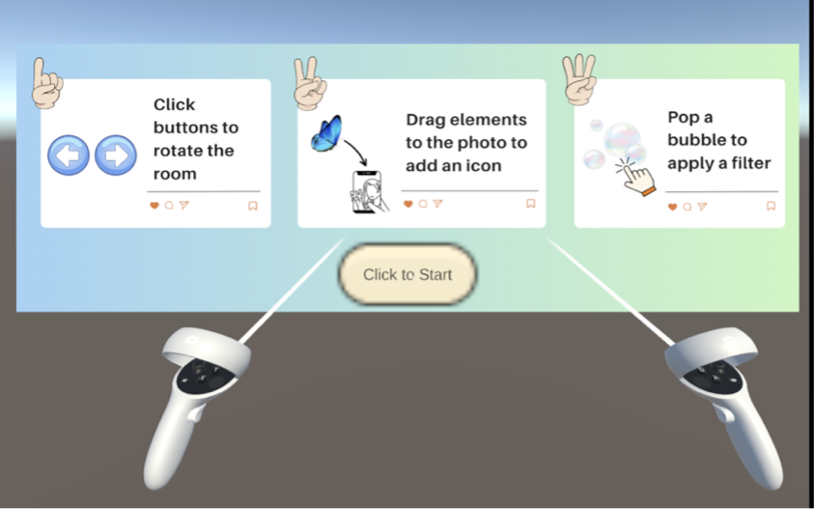
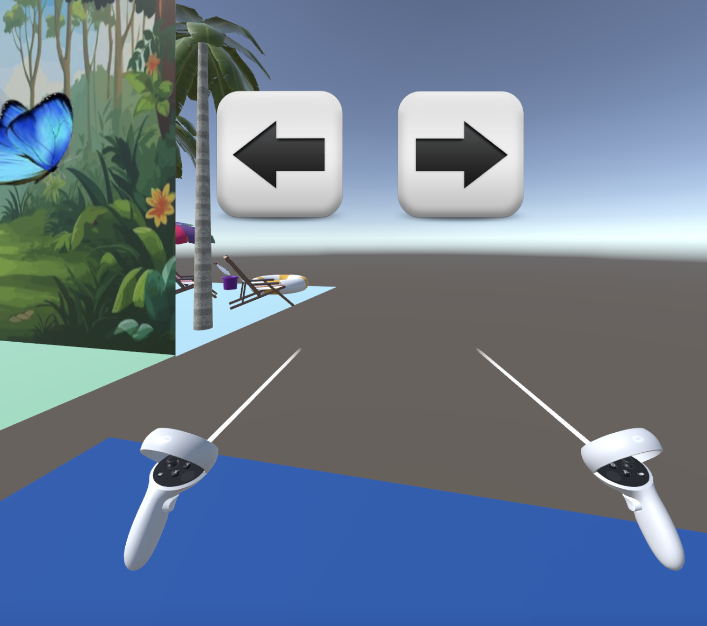
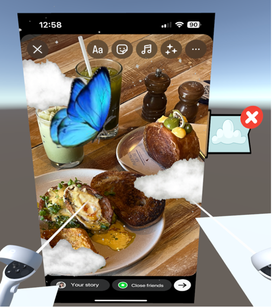

# InstagramStoryEditing-UnityProject

An immersive experience for editing Instagram story posts in a 3D environment using Meta Quest 2. The project utilized Unity and C# to create interactive features, while leveraging Meta's building blocks to ensure smooth user interaction within the virtual environment.  

## Requirement

[Unity 2022.3.44f1 (Apple Sillicon, LTS)](https://unity.cn/release-notes/lts/2022/2022.3.44f1)

## System logic and functionality

### Instruction panel
  * Users enter the scene with an instruction display, explaining available features.
  * Clicking the “Click to Start” button redirects them to the main scenes, where background music starts playing.
    

### Main Functionality and interactions
  There are two interactions that users can interact with the system:
  #### 1. Room switching and thematic elements:
  - Users will see three themed rooms (forest, beach, and city), each with various 2D and 3D thematic elements. 
    * Forest Room:
    </img>
    * Beach Room:
    </img>
    * City Room:
    </img>

  -	Left and right buttons allow users to click with the controller to rotate the rooms and access different elements. 
  </img>
  -	Users can grab these elements from a distance and drop them onto the photo. They can drag and drop as many elements as they like onto the photo, even placing the same one multiple times. 
  -	The element converts into an icon once it’s dropped, appearing at the release position on the photo. 
  -	To enhance usability, a success sound plays when users successfully grab or place an element on the photo. While holding the element over the photo, another sound indicates that they can release it to convert it into an icon. If they release the element before it reaches the photo, an error sound plays, and the element will returns to its original position in the room.  

#### 2. Bursting bubbles to apply filters:
-	Bubbles appear in the themed rooms, each containing an icon representing different filter styles related to the room’s theme.
</img>
-	Users can pop a bubble to apply the associated filter, triggering a bubble-bursting animation plays and a success message confirming the filter application.
    - For example, bursting a bubble with a cloud icon applies a ‘Cloud Filter’ to the photo, and various clouds will appear on it. 
    </img>
    </img>
    
Users can apply multiple filters if they wish. When a filter is applied, a bookmark with its icon appears next to the photo, accompanied by a close icon. Clicking the close icon removes the filter, and the corresponding bubble is rebuilt and reappears in the room for users to reapply.
  - More examples: 
    1. Applied cloud filter with a butterfly icon:
      </img>
    2. Applied flower filter:
      </img>
      </img>
    3. Applied Cloud filter and Flower filter:

        </img>

### Input Devices
* Meta Quest Simulator on Unity
  * WASD for movement
  * Press Y and released for teleportation
  * Press T to click buttons and bubbles
  * Press U to grab the elements
* Meta Quest 2 headset and controller
  * Use joystick on the controller for teleporting
  * Use grip button (on the side of the controller) to grabs elements
  
    *More information can be found on the Meta website: https://www.meta.com/en-gb/help/quest/articles/getting-started/getting-started-with-quest-2/using-touch-controllers-quest/?srsltid=AfmBOop5-MKmCJadfoEH4bKIv4vzFHtTIHN1cQ6bpbvxEpjK9ZUe4_-S*